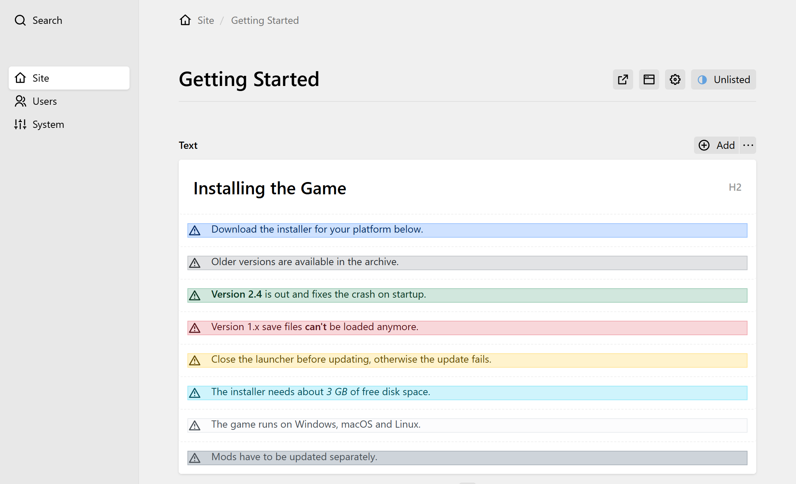

# Bootstrap Blocks

A [Kirby](https://getkirby.com/) plugin implementing [Bootstrap Components](https://getbootstrap.com/docs/5.3/components/) as [Blocks](https://getkirby.com/docs/reference/panel/blocks).



## Requirements

- Kirby 3.10, 4 or 5
- PHP 8.1 or newer, note that Kirby 5 needs PHP 8.2
- Bootstrap 5.3, which your site has to load itself (CSS and JS)

Version 2.0 switched from Bootstrap 3.4 to 5.3, which renamed a few classes, e.g. the close button. If your site still uses Bootstrap 3.4, stay on version 1.x of the plugin.

## Supported Components

- [Alerts](https://getbootstrap.com/docs/5.3/components/alerts/)
- [Tables](https://getbootstrap.com/docs/5.3/content/tables/)

## Installation

### Composer

```
composer require expl0it3r/kirby-bootstrap-blocks
```

### Git Submodule

```
git submodule add https://github.com/eXpl0it3r/kirby-bootstrap-blocks.git site/plugins/kirby-bootstrap-blocks
```

### Download

[Download](https://github.com/eXpl0it3r/kirby-bootstrap-blocks/archive/master.zip) the repository and extract its content to `site/plugins/kirby-bootstrap-blocks`.

## Usage

Add the `alert` and `bootstrap-table` blocks to the fieldsets of your blocks field:

```yml
fields:
  text:
    type: blocks
    label: Text
    fieldsets:
      - heading
      - text
      - list
      - image
      - alert
      - bootstrap-table
```

An alert has a type (primary, secondary, success, danger, warning, info, light or dark), can be dismissible and its text supports bold and italic. The dismiss button uses Bootstrap's `data-bs-dismiss="alert"`, as such it needs Bootstrap's JavaScript.

A table is edited in a grid of cells, where rows and columns can be added and removed. Pasting several cells from a spreadsheet fills the grid from the current cell on and adds rows and columns as needed. The cells support KirbyTags and Markdown, the first row can be the header and the table can be striped, hover, bordered or small. Tables are always wrapped in `table-responsive`, so wide tables scroll on small screens.

Note that the block is called `bootstrap-table`, since Kirby already has a `table` block type, which is used for the table preview of other blocks.

## Development

The Panel previews and the grid editor of the table are Vue components in `src/`, which get built to `index.js` and `index.css`. Run the following commands in the plugin directory:

- `npm run dev` watches the files in `src/` and builds on every change
- `npm run build` builds the files in `src/` once

Note that the build uses kirbyup 3, as the Panel of Kirby 3, 4 and 5 still runs on Vue 2.

## Credits

- Built with the [Custom Block Type](https://getkirby.com/docs/cookbook/panel/custom-block-type) cookbook article
- A million thanks to the whole Kirby Team! ❤
